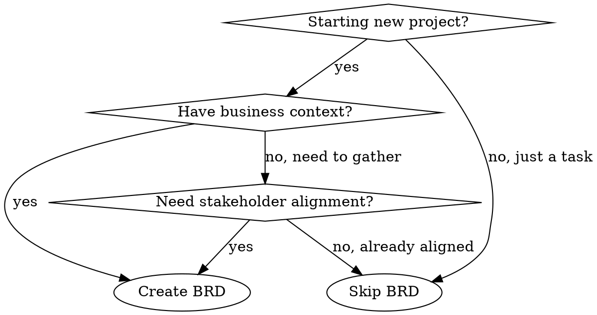

# BRD Creator

Create comprehensive Business Requirements Documents (BRDs) that establish clear business context, stakeholder alignment, and high-level requirements BEFORE diving into product or technical details.

## Core Principle

**BRD answers "WHY" and "WHO" — not "HOW" or "WHAT".**

- **WHY**: Business context, problems, goals, success criteria
- **WHO**: Stakeholders, users, roles, responsibilities
- **NOT**: Technical architecture, API design, database schema, implementation details

## When to Use This Skill



**Use BRD when:**
- New project or major initiative
- Multiple stakeholders need alignment
- Business context is unclear or undocumented
- Need to justify investment or resources
- Requirements are fuzzy and need clarification

**Skip BRD when:**
- Small feature or bug fix
- Clear, well-understood requirements
- Single stakeholder with clear vision
- Just documenting existing decisions

## Discovery Workflow

### Phase 1: Understand Business Context

Before writing anything, gather this information through conversation:

**Required Information:**
1. **Business Problem** — What problem are we solving? Why now?
2. **Business Goals** — What outcomes do we want? How do we measure success?
3. **Target Users** — Who will use this? What are their roles?
4. **Constraints** — Timeline, budget, resources, compliance requirements
5. **Scope** — What's in? What's explicitly out?
6. **Stakeholders** — Who cares about this? Who decides?

**Discovery Questions:**
```
1. What business problem triggered this project?
2. Who is affected by this problem? How badly?
3. What does success look like in 6 months? 1 year?
4. Who are the primary users? Secondary users?
5. What constraints do we have (time, budget, compliance)?
6. What's explicitly out of scope for now?
7. Who needs to approve this? Who else cares?
8. Are there existing systems/processes this replaces or integrates with?
```

**Pro tip:** If the user can't answer these questions, the BRD process helps surface them. Don't proceed to writing until you have enough context.

### Phase 2: Generate BRD Structure

Use this standard BRD template:

```markdown
# BRD: [Project Name] Business Requirements Document

> Version: v0.1-draft
> Date: YYYY-MM-DD
> Status: draft/review/approved

---

## 1. Project Background & Goals

### 1.1 Background
[Why this project exists. What problem we're solving. Current state.]

### 1.2 Business Goals
[What outcomes we want. Measurable objectives.]

### 1.3 Design Principles (optional)
[Guiding principles for decision-making.]

### 1.4 Implementation Strategy (optional)
[Phased approach if applicable.]

---

## 2. Users & Roles

| Role | Description | MVP? |
|------|-------------|------|
| [Role name] | [Who they are, what they do] | Yes/No |

---

## 3. Core Functional Requirements

### 3.1 [Category 1]
[Description of functional area]

| Configuration | Description |
|---------------|-------------|
| [Item] | [What it is] |

### 3.2 [Category 2]
...

---

## 4. Non-Functional Requirements

### 4.1 Deployment Architecture
[High-level deployment context]

### 4.2 Technical Stack (optional)
[Only if business-relevant — otherwise defer to TRD]

### 4.3 Multi-tenancy (if applicable)
### 4.4 Scalability
### 4.5 Observability

---

## 5. Glossary

| Term | Definition |
|------|------------|
| [Term] | [What it means in this context] |

---

## 6. Appendix

### 6.1 Open Questions
- [ ] [Question 1]
- [ ] [Question 2]

### 6.2 References
- [Relevant documents, links]

---

## Revision History

| Version | Date | Changes | Author |
|---------|------|---------|--------|
| v0.1-draft | YYYY-MM-DD | Initial draft | - |
```

## Critical Rules (Avoid These Mistakes)

### Rule 1: No Technical Implementation Details

**BRD is NOT the place for:**
- Database schema design
- API specifications
- Class diagrams
- Code examples
- Specific technology choices (unless business-mandated)

```
❌ BAD: "Use PostgreSQL with read replicas for high availability"
✅ GOOD: "System must support 10,000 concurrent users with <100ms response time"

❌ BAD: "Implement REST API with JWT authentication"
✅ GOOD: "Users must be authenticated before accessing sensitive data"
```

### Rule 2: Maintain Document Hierarchy

```
BRD (Business Requirements Document)
├── WHY — Business context, goals, success criteria
├── WHO — Users, roles, stakeholders
└── WHAT — High-level functional requirements (NOT implementation)

PRD (Product Requirements Document)
├── User stories and acceptance criteria
├── Feature specifications
├── UX flows and wireframes
└── Success metrics

TRD (Technical Requirements Document)
├── Architecture design
├── API specifications
├── Database schema
├── Technology stack decisions
└── Implementation details
```

**If you're writing technical details in BRD → STOP → Move to TRD**

### Rule 3: Be Specific and Measurable

```
❌ BAD: "The system should be fast"
✅ GOOD: "Page load time < 2 seconds for 95th percentile"

❌ BAD: "Support many users"
✅ GOOD: "Support 10,000 concurrent users during peak hours"

❌ BAD: "Easy to use"
✅ GOOD: "New users can complete core task within 5 minutes without training"
```

### Rule 4: Keep It Living

- Mark status clearly (draft/review/approved)
- Track revision history
- List open questions explicitly
- Update when requirements change

## Phase 3: Logic & Completeness Review (Critical)

After drafting the BRD, perform these checks BEFORE finalizing:

### 3.1 Logic Consistency Check

**Goal-Requirement Alignment:**
```
For each business goal in section 1.2:
  → Is there at least one requirement that directly supports it?
  → Can we trace from requirement back to goal?
  → Are there orphan requirements (no goal connection)?
```

**Role-Function Alignment:**
```
For each role in section 2:
  → Are their needs represented in functional requirements?
  → Are there functions that no role cares about? (red flag)
  → Are there roles with no functions? (red flag)
```

**Scope Consistency:**
```
For each requirement:
  → Is it clearly within scope boundaries?
  → Are there hidden scope expansions in requirements?
  → Do constraints in 1.1 align with what's being asked?
```

### 3.2 Completeness Check

**Stakeholder Coverage:**
- [ ] Every stakeholder mentioned has their concerns addressed
- [ ] No stakeholder group is implicitly assumed but not listed
- [ ] Approval chain is clear (who needs to sign off)

**Constraint Coverage:**
- [ ] Time constraints mentioned and realistic
- [ ] Budget/resource constraints considered
- [ ] Compliance/regulatory constraints identified
- [ ] Technical constraints (if any) stated at business level

**Assumption Surfacing:**
- [ ] What are we assuming about user behavior?
- [ ] What are we assuming about existing systems?
- [ ] What are we assuming about resources?
- [ ] List all assumptions explicitly in Appendix

### 3.3 Clarity & Ambiguity Check

**Trigger Questions:**
1. Are there any terms that could mean different things to different readers?
2. Are there requirements that could be interpreted multiple ways?
3. Are there "obvious" things that weren't written down? (Write them down)
4. Are there dependencies between requirements that aren't stated?

**Ambiguity Resolution Process:**
```
For each ambiguous statement found:
  1. Flag it explicitly
  2. List possible interpretations
  3. Ask user to clarify
  4. Replace with specific, measurable statement
```

## Self-Review Checklist

Before finalizing the BRD, verify:

### Completeness
- [ ] **Problem is clear**: Anyone can understand why this project exists
- [ ] **Goals are measurable**: Success can be objectively determined
- [ ] **Users are identified**: We know who we're building for
- [ ] **Scope is bounded**: Clear what's in and out
- [ ] **Stakeholders are named**: We know who needs to approve

### Logic Consistency
- [ ] **Goal-requirement traceability**: Each requirement links to a goal
- [ ] **Role-function coverage**: Each role's needs are addressed
- [ ] **No orphan content**: Everything has a clear purpose
- [ ] **Assumptions explicit**: Hidden assumptions are surfaced

### Quality
- [ ] **No technical details**: Implementation is NOT specified (that's TRD)
- [ ] **Open questions listed**: Unresolved items are tracked
- [ ] **Consistent terminology**: Same terms mean same things throughout
- [ ] **Ambiguities resolved**: No statements with multiple interpretations

## Common Anti-Patterns

| Anti-Pattern | Why It's Bad | Fix |
|--------------|--------------|-----|
| **Kitchen Sink** | Everything including technical details | Focus on business needs only |
| **Vague Goals** | "Improve user experience" | Make measurable: "Reduce task completion time by 30%" |
| **Hidden Assumptions** | Unstated constraints cause rework | List assumptions explicitly |
| **Missing Stakeholders** | Surprised by late objections | Identify all stakeholders early |
| **Scope Creep** | "Also need X, Y, Z..." | Define MVP clearly, defer to backlog |

## Example Usage

**User:** "Help me create a BRD for a customer portal"

**Assistant will:**
1. Ask discovery questions about business problem, goals, users
2. Identify constraints and scope
3. Generate BRD using template
4. Review for technical leakage (move any to TRD)
5. List open questions for stakeholder review
6. Track revision as needs evolve

## Relationship to Other Documents

```
                    ┌─────────────────────────────────────┐
                    │           Business Need             │
                    └─────────────────┬───────────────────┘
                                      │
                                      ▼
                    ┌─────────────────────────────────────┐
                    │         BRD (This Document)          │
                    │   WHY + WHO + High-level WHAT        │
                    └─────────────────┬───────────────────┘
                                      │
                    ┌─────────────────┴───────────────────┐
                    ▼                                     ▼
    ┌───────────────────────────┐     ┌───────────────────────────┐
    │           PRD              │     │           TRD              │
    │   Features + User Stories  │     │   Architecture + Tech      │
    │   UX Flows + Metrics       │     │   APIs + Database          │
    └───────────────────────────┘     └───────────────────────────┘
```

**Key insight:** BRD comes FIRST. PRD and TRD derive from BRD. If BRD is wrong, everything downstream is wrong.

---

## Phase 4: Iteration & Refinement (Critical)

BRD is a living document. After initial drafting, expect multiple rounds of iteration:

### 4.1 Iteration Triggers

**When to iterate:**
- Stakeholder feedback received
- New information discovered
- Scope changes requested
- Inconsistencies found during review
- Assumptions proved wrong

### 4.2 Iteration Workflow

```
For each feedback item:
  1. Classify: Is it a clarification, addition, change, or deletion?
  2. Impact: Which sections does this affect?
  3. Consistency: Does this change create inconsistencies elsewhere?
  4. Update: Make the change
  5. Trace: Update revision history
  6. Re-check: Run Phase 3 checks again
```

### 4.3 Version Control

**Revision History Best Practices:**
- Increment version for each significant change
- Record what changed and why
- Note who requested/approved the change
- Keep previous versions accessible for reference

```
| Version | Date | Changes | Author | Status |
|---------|------|---------|--------|--------|
| v0.1-draft | 2026-03-22 | Initial draft | AI | draft |
| v0.2-draft | 2026-03-22 | Added stakeholder feedback; clarified scope | AI | draft |
| v0.5-review | 2026-03-23 | Incorporated tech team input; ready for review | AI | review |
| v1.0-approved | 2026-03-24 | Approved by all stakeholders | PM | approved |
```

### 4.4 Common Iteration Scenarios

| Scenario | Action |
|----------|--------|
| **Stakeholder adds requirement** | Check scope impact → Update if within scope → Defer to backlog if out of scope |
| **Technical team flags infeasibility** | Clarify business need → Explore alternatives → Update requirement |
| **User feedback changes priorities** | Re-evaluate MVP scope → Update phased approach if needed |
| **External constraint discovered** | Document constraint → Assess impact → Update affected sections |
| **Terminology confusion** | Add to glossary → Ensure consistent usage throughout |

### 4.5 Sign-off Process

**Before marking BRD as "approved":**
- [ ] All stakeholders have reviewed
- [ ] All open questions resolved
- [ ] All Phase 3 checks pass
- [ ] Revision history complete
- [ ] Next steps (PRD/TRD) identified

---

## References & Inspiration

This skill synthesizes best practices from multiple sources:

| Source | Key Insights Borrowed |
|--------|----------------------|
| **jamesrochabrun/prd-generator** (GitHub) | Discovery phase structure, SMART requirements, self-review checklist |
| **johnnychauvet/prd-skill** (GitHub) | JTBD (Jobs To Be Done) thinking, conversational discovery flow |
| **alirezarezvani/claude-skills** (GitHub) | Skill structure patterns, progressive disclosure |
| **Real-world collaboration experience** | Document hierarchy (BRD→PRD→TRD), iteration importance, common mistakes |

**Why these sources:**
- They represent high-star, production-tested patterns from the Claude Code community
- They balance structure with flexibility
- They emphasize discovery before documentation
